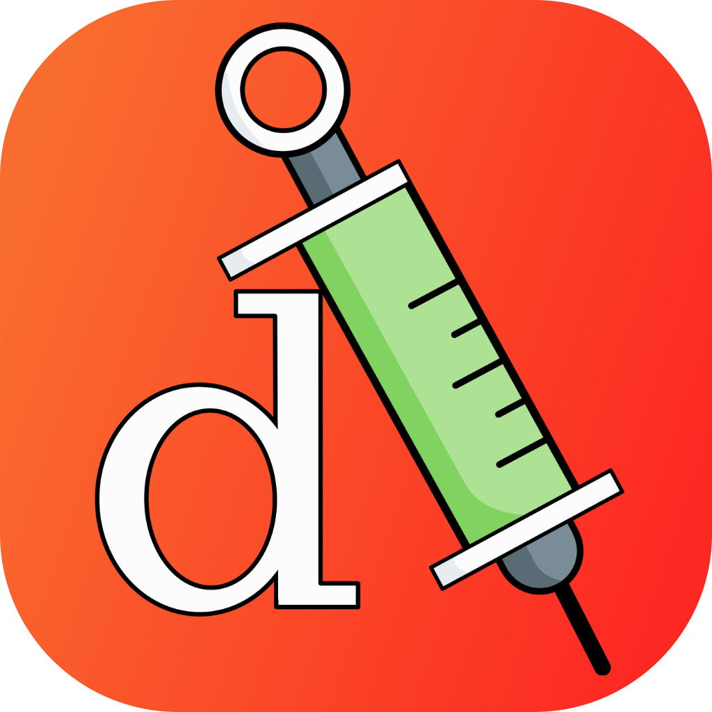

<div align="center">
  <br><br>

  **Injectle** is a service locator for dependency injection in Swift.

  [](https://github.com/simonsuska/injectle/releases)
  [](https://swift.org)
  [](https://github.com/simonsuska/injectle/blob/main/LICENSE)
</div>

---

## 🔎 Table of Contents

- [🎯 About](#about)
- [🚀 Getting Started](#getting_started)
- [💫 Usage](#usage)
- [🚫 Limitations](#limitations)
- [⚖️ License](#license)

<div id="about"/>

## 🎯 About


<div id="getting_started"/>

## 🚀 Getting Started

To get started, add a dependency to your project in Xcode. You may proceed as follows\*:

#### If you want to add a dependency to a Xcode project

1. From the menu bar in Xcode, choose *File* &#8594; *Add Package Dependencies...*
2. A dialog opens where you can add the dependency by pasting the URL of the repository 
   into the search bar in Xcode. \
   If you cloned this repository, you can add a dependency to the repository on your
   machine by choosing *Add Local...*
3. Add the package dependency to the app target

#### If you want to add a dependency to another Swift package

Customize your `Package.swift` file according to the following code.
You may specify a branch instead of a version number.

```swift
let package = Package(
    name: "SomeSwiftPackage",
    dependencies: [
        .package(url: "https://github.com/simonsuska/injectle.git", from: "1.0.0")
    ],
    targets: [
        .target(
            name: "SomeSwiftPackage",
            dependencies: [.product(name: "Injectle", package: "injectle")]),
        // You may also add a dependency to the test target to use the test locator
        .testTarget(
            name: "SomeSwiftPackageTests",
            dependencies: [.product(name: "Injectle", package: "injectle")]),
    ]
)
```

\*Done with Xcode Version 15.0

<div id="usage"/>

## 💫 Usage


<div id="limitations"/>

## 🚫 Limitations


<div id="license"/>

## ⚖️ License

Injectle is released under the GNU GPL-3.0 license. See [LICENSE](LICENSE) for details.
